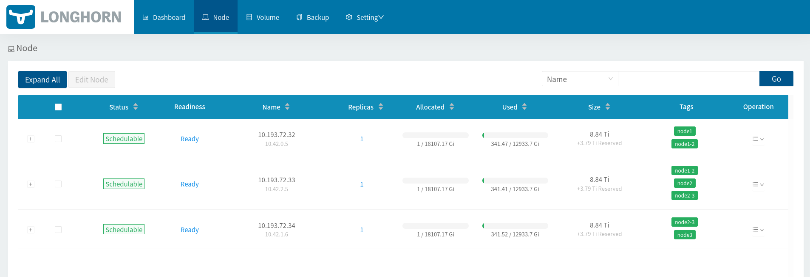
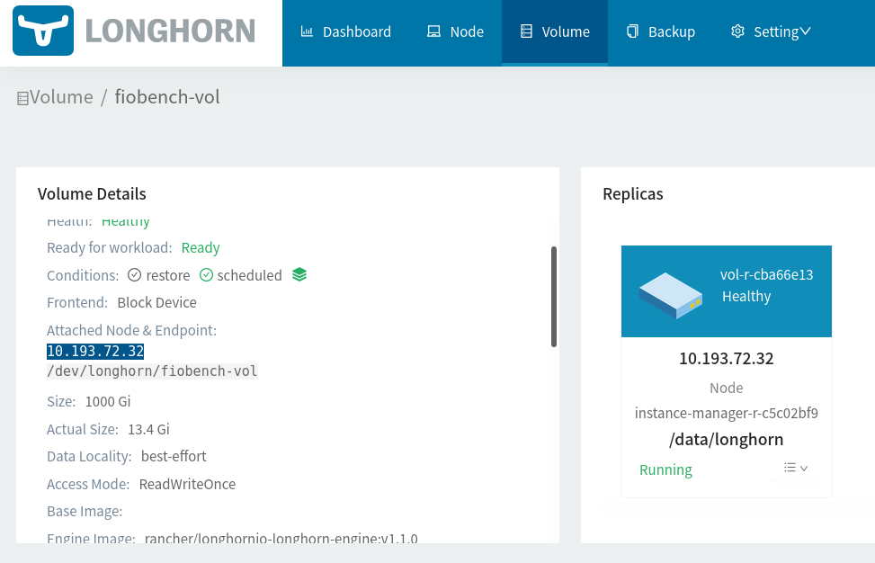
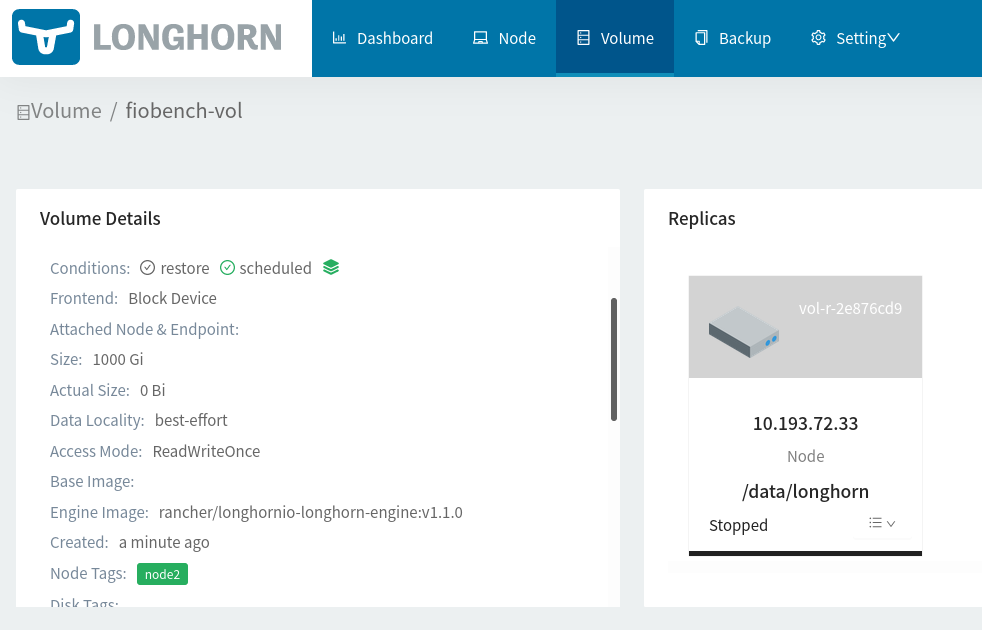
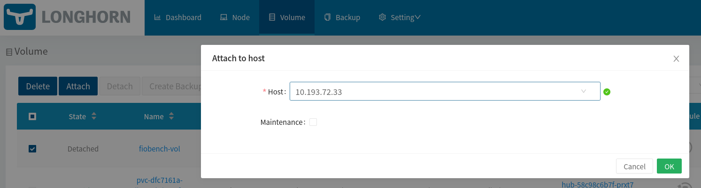
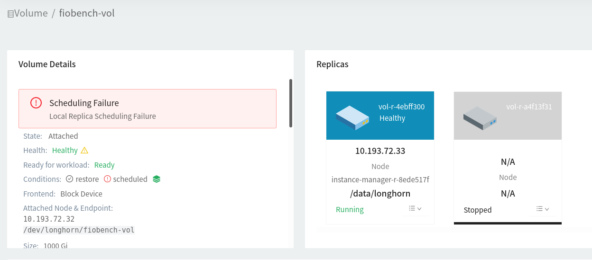
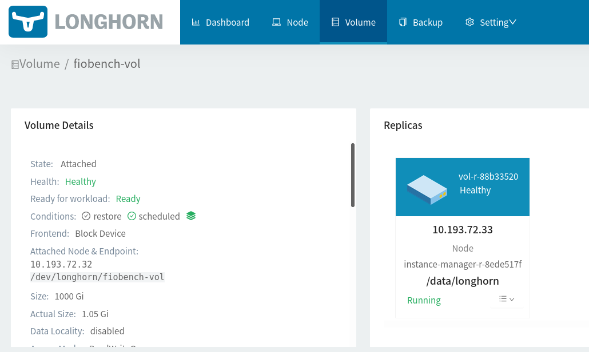
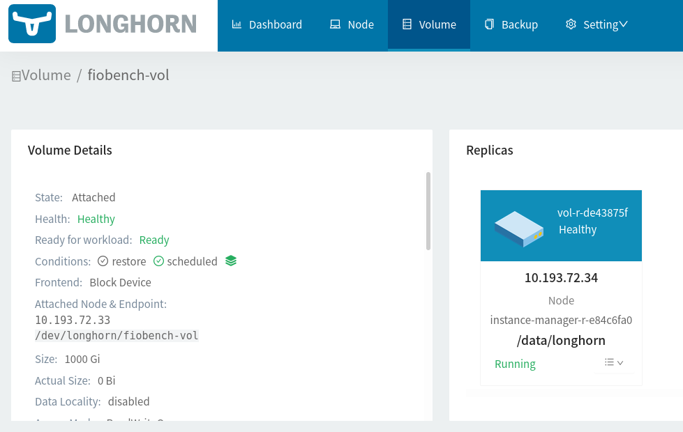
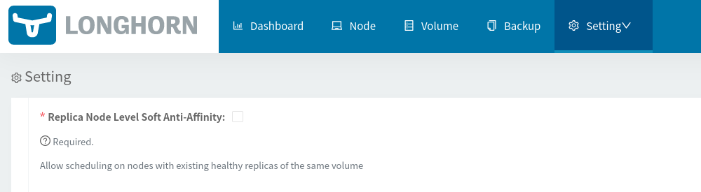
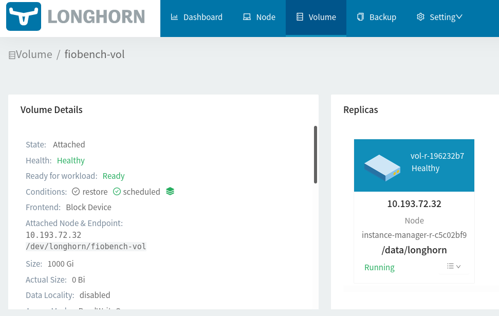

# Faisabilité
A ma connaissance, dans Longhorn, il y a 3 paramètres permettant de modifier le placement des replicas, du volume et du workload:
* nodeSelector (PV)
* nodeSelector (workload container template)
* nodeAffinity (PV)
* dataLocality
* Replica soft level node anti-affinity (Longhorn UI)

On va partir d'un déploiement fonctionnel puis tester 1 à 1 les différents paramètres pour:
1. séparer le workload du volume
2. séparer la réplica du volume

## Préparations
On utilise le Longhorn UI pour tagguer les nodes:
* chaque node a reçu un tag `nodeX`, où X varie entre 1 et 3
* chaque node a reçu un tag `nodeX-Y` où X < Y, X et Y varie entre 1 et 3.


Pour partir d'une base saine, on teste une configuration simple.

On part du deployment `01-all-on-same-node.yaml`. En observant les logs du pod celui-ci marche :
```bash
> kubectl logs --follow --namespace=mercado \
$(kubectl get pods --namespace=mercado -o=jsonpath='{.items[0].metadata.name}')
Will run all fio jobs shortly thereafter...
fio-3.27
Jobs to be executed:
architecting-it-test1-read
architecting-it-test2-write
architecting-it-test3-read-bandwidth
architecting-it-test4-write-bandwidth
architecting-it-test5-read-latency
architecting-it-test6-write-latency
architecting-it-test7-sequential-read
architecting-it-test8-sequential-write
architecting-it-test9-read-write-mix
Executing job architecting-it-test1-read...
^C
```

On inspecte le volume:


On constate que le node 1 contient le volume et la replica.

Le pod est aussi sur le même node :
```bash
> kubectl get pods --namespace=mercado -o=jsonpath='{.items[0].spec.nodeName}'
10.193.72.32
```

On a toutes les informations que l'on voulait, on nettoie les ressources:

```bash
> kubectl delete -f 01-all-on-same-node.yaml 
persistentvolume "fiobench-pv" deleted
persistentvolumeclaim "fiobench-pvc" deleted
deployment.apps "fiobench-deployment" deleted
```

et on supprime le volume depuis le Longhorn UI.

## Test séparation workload/volume
Dans le deployment `02-separate-volume-node-affinity-and-tag.yaml`, on modifie le `nodeAffinity` du volume et le tag de `nodeSelector` au volume créé pour le placer sur le node 2.

On lit: 
```bash
> kubectl describe pod -n mercado
...
Events:
  Type     Reason            Age   From               Message
  ----     ------            ----  ----               -------
  Warning  FailedScheduling  80s   default-scheduler  0/3 nodes are available: 1 node(s) had volume node affinity conflict, 2 node(s) didn't match node selector.
  Warning  FailedScheduling  80s   default-scheduler  0/3 nodes are available: 1 node(s) had volume node affinity conflict, 2 node(s) didn't match node selector.
```

La replica se trouvait bien sur node 2 mais le volume n'a pas pu être attaché:

---

Dans le deployment `03-separate-volume-node-affinity.yaml`, on modifie le `nodeAffinity` du volume pour le placer sur le node 2 et sans mettre de tag.

On lit:
```bash
> kubectl describe pod -n mercado
...
Events:
  Type     Reason            Age   From               Message
  ----     ------            ----  ----               -------
  Warning  FailedScheduling  4s    default-scheduler  0/3 nodes are available: 3 pod has unbound immediate PersistentVolumeClaims.
  Warning  FailedScheduling  4s    default-scheduler  0/3 nodes are available: 3 pod has unbound immediate PersistentVolumeClaims.
```
Le volume n'est pas attaché d'après l'UI Longhorn:


Si l'on attache manuellement le volume:


Alors l'erreur du pod change à :
```bash
> kubectl describe pod -n mercado
...
Events:
  Type     Reason            Age    From               Message
  ----     ------            ----   ----               -------
  Warning  FailedScheduling  2m52s  default-scheduler  0/3 nodes are available: 1 node(s) had volume node affinity conflict, 2 node(s) didn't match node selector.
  Warning  FailedScheduling  2m52s  default-scheduler  0/3 nodes are available: 1 node(s) had volume node affinity conflict, 2 node(s) didn't match node selector.
  ```
---
Dans le deployment `04-separate-volume-tag.yaml`, on tag le volume créé pour le placer sur le node 2 et on enlève le `nodeAffinity`.

Le container démarre mais le volume se trouve sur le node 1. La replica est aussi absente:

---
Dans le deployment `05-separate-volume-tag-disabled-data-locality.yaml`, on change du déploiement 04 en désactivant la `dataLocality`.

Le volume se trouve sur le node 1 tandis que la replica et l'instance manager se trouve sur le node 2:


On voit que le node selector n'a d'effet que sur le Longhorn engine et la replica. Le workload doit se trouver sur le node où le volume est.

---
Dans un dernier essai pour séparer le workload du volume, on déploie `06-separate-volume-attach.yaml` en oubliant `nodeSelector` et `nodeAffinity`. On va simplement attacher le volume au node 2 et voir ce qu'il se passe.

Le pod se trouve bien sur le node 1:
```bash
> kubectl get pods --namespace=mercado -o=jsonpath='{.items[0].spec.nodeName}'
10.193.72.32
```
Le volume se trouve bien sur le node 2, la replica se trouve sur le node 3:


...mais le pod ne peut pas démarrer:
```bash
> kubectl get pod describe pod -n mercado
...
Events:
  Type     Reason              Age                    From                     Message
  ----     ------              ----                   ----                     -------
  Normal   Scheduled           6m41s                  default-scheduler        Successfully assigned mercado/fiobench-deployment-d9d4f4c89-vsvnc to 10.193.72.32
  Warning  FailedAttachVolume  6m41s (x2 over 6m42s)  attachdetach-controller  AttachVolume.Attach failed for volume "fiobench-pv" : rpc error: code = Aborted desc = The volume fiobench-vol is already attached but it is not ready for workloads
  Warning  FailedAttachVolume  30s (x9 over 6m40s)    attachdetach-controller  AttachVolume.Attach failed for volume "fiobench-pv" : rpc error: code = FailedPrecondition desc = The volume fiobench-vol cannot be attached to the node 10.193.72.32 since it is already attached to the node 10.193.72.33
  Warning  FailedMount         8s (x3 over 4m39s)     kubelet                  Unable to attach or mount volumes: unmounted volumes=[fiobench-storage], unattached volumes=[fiobench-storage default-token-9jncr]: timed out waiting for the condition

```
En effet, le pod demande a ce que le volume se trouve sur le même node que lui. Cela va en contradiction avec la [documentation Longhorn](https://longhorn.io/docs/1.1.2/high-availability/data-locality/#data-locality-settings) qui dit que: *"When data locality is disabled, a Longhorn volume can be [...] accessed by a pod running on any node in the cluster."*

## Test séparation volume/(single) replica
Dans une deuxième partie, on désire montrer que l'on peut séparer le volume de la replica en les plaçant sur des nodes différents.

On déploie `07-separate-replica-disable-data-locality.yaml` en utilisant `nodeSelector` et `nodeAffinity` pour que la replica puisse se trouver soit sur le node 1, soit sur le node 2. `Replica Node Level Soft Anti-Affinity est désactivé par défaut dans le Longhorn UI :


On constate que la replica et le volume se trouve sur le node 1 :


---
TODO drop les restrictions une à une...