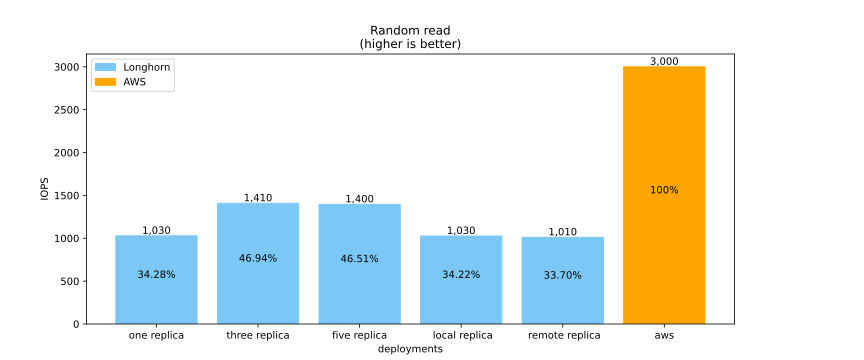

## DevOps: Mise en place de cloud-native storage 

Pablo Mercado

note: f12 > console > Reveal.configure({ progress: true, slideNumber: true })

---
<!-- .slide: style="text-align: left"; -->
### Sommaire 
1. Introduction
1. Comparatif
1. Proof of Concept
1. Analyse
1. Conclusion

---
<!-- .slide: style="text-align: left; font-size: 0.6em" -->
## Introduction
1. Containerisation
2. Stockage
---
<!-- .slide: style="text-align: left; font-size: 0.6em" -->
### Introduction - Containerisation
*Pourquoi passer de la VM au container?*
* prix exhorbitant d'une licence VMware
* overhead dû à la virtualisation du hardware

**Note**: [initiative](https://www.rts.ch/info/suisse/12365592-une-initiative-en-vue-pour-assurer-la-securite-numerique-de-la-suisse.html) sur la souveraineté numérique en cours d'élaboration

note: licence par processeur pouvant facilement totaliser jusqu'à $100k 
---
<!-- .slide: style="text-align: left; font-size: 0.6em" -->
### Introduction - Stockage
TODO talk about Jens Axboe, IO scheduler, mount...
---
<!-- .slide: style="text-align: left; font-size: 0.6em" -->
## Comparatif
1. EBS
1. Longhorn
1. Autres solutions de stockage
---
<!-- .slide: style="text-align: left; font-size: 0.6em" data-background-image="img/aws.svg" data-background-position="90% 10%" data-background-size="10%" -->
### Comparatif - EBS
* AWS est le cloud provider le plus populaire
* offre un système de backup
* propriétaire

Note: 99.999999999% de durabilité claim pour S3
---
<!-- .slide: style="text-align: left; font-size: 0.6em" data-background-image="img/longhorn.svg" data-background-position="90% 10%" data-background-size="10%" -->
### Comparatif - Longhorn
* installation facile depuis Rancher
* offre un système de backup
* open source
---
<!-- .slide: style="text-align: left; font-size: 0.6em" -->
### Comparatif - Autres solutions de stockage (1/2)
TODO landscape, explaine maturity levels
---
### Comparatif - Autres solutions de stockage (2/2)
<!-- .slide: style="text-align: left; font-size: 0.6em" -->
D'après le rapport technique d'Architecting-IT (méthodologie suivant dbench)
* OpenEBS mauvais
* Rook+Ceph meilleur que Longhorn ()
---
<!-- .slide: style="text-align: left; font-size: 0.6em" -->
## Proof of Concept
1. Fonctionnement de Longhorn
1. Options FIO
1. Configuration cluster EKS
---
<!-- .slide: style="text-align: left; font-size: 0.6em" -->
### PoC - Fonctionnement de Longhorn


---
<!-- .slide: style="text-align: left; font-size: 0.6em" -->
### PoC - Options FIO
TODO talk about options
> "beautiful quote"
---
<!-- .slide: style="text-align: left; font-size: 0.6em" -->
### PoC - Configuration cluster EKS
* Sélection d'éléments "general purpose" -> éviter "EBS optimized"
	* instance EC2: t3.small
	* volume EBS: gp2
* même version de Kubernetes que le cluster de l'école
---

## Deployment - manifest
```bash
kubectl apply -f ex.yaml
```
---

## Deployment - FIO job

```toml
[[idk]]
option=1

```
---

## Benchmark results


---

## Conclusion
TODO

---

## Questions ?
<!-- .slide: data-background="#d5c5e8" data-transition="page" -->

