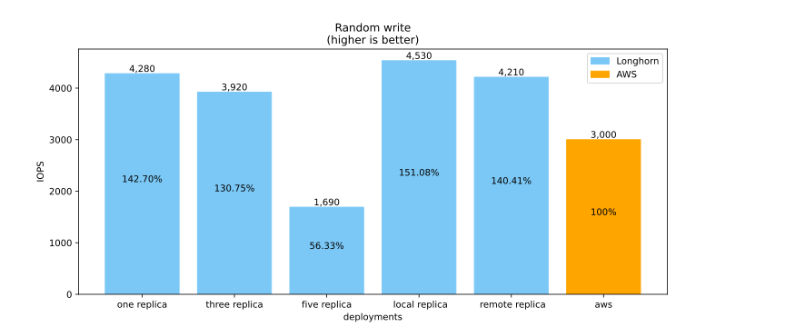

<!-- .slide: style="font-size: 0.5em" data-background-image="img/logo_heig-vd-2020.svg" data-background-position="90% 10%" data-background-size="10%" -->
# DevOps: Mise en place de cloud-native storage

  
Pablo Mercado
  

**Responsable**: Marcel Graf

note: f12 > console > Reveal.configure({ progress: true, slideNumber: true })

Bonjour, ... je DEFENDS mon travail de ...

---
<!-- .slide: style="text-align: left"; -->
## Sommaire

1. Introduction
1. Comparatif
1. Proof of Concept
1. Analyse
1. Conclusion

note: intro - quel problème on tente de résoudre

---
<!-- .slide: style="text-align: left; font-size: 0.6em" -->
## Introduction

1. Containerisation
1. Stockage
1. Stockage dans un cluster Kubernetes

---
<!-- .slide: style="text-align: left; font-size: 0.6em" -->
### Introduction - Containerisation

*Pourquoi passer de la VM au container?*

* prix exhorbitant d'une licence VMware
* overhead dû à la virtualisation du hardware

**Note**: [initiative](
https://www.rts.ch/info/suisse/12365592-une-initiative-en-vue-pour-assurer-la-securite-numerique-de-la-suisse.html)
sur la souveraineté numérique en cours d'élaboration

note:

* démocratisation de k8, mode de développement standard
* tourner une application dans une VM n'est pas très performant
* licence par processeur pouvant facilement totaliser jusqu'à $100k

---
<!-- .slide: style="text-align: left; font-size: 0.6em" -->
### Introduction - Stockage

Jens Axboe? <!-- .element: class="fragment" data-fragment-index="1" -->

[Twitter](https://twitter.com/axboe) <!-- .element: class="fragment" data-fragment-index="2" -->

* bloc layer maintainer du Linux kernel <!-- .element: class="fragment" data-fragment-index="2" -->
* outil de benchmark de stockage: FIO <!-- .element: class="fragment" data-fragment-index="2" -->
* FIO est open source et régulièrement mis à jour <!-- .element: class="fragment" data-fragment-index="2" -->

FIO pour benchmark du CAS (Container attached storage)? <!-- .element: class="fragment" data-fragment-index="3" -->

note:

* parlons de stockage pur avant le stockage ds un cluster k8
* au moins 15 ans qu'il a créé FIO, maintainer actuel de FIO
* plrs personnes ont essayé de benchark du CAS avec FIO (papers, rapports techniques...)

---
<!-- .slide: style="text-align: left; font-size: 0.6em" -->
### Introduction - Stockage dans un cluster Kubernetes

* Kubernetes ne fournit pas de stockage persistent par défaut <!-- .element: class="fragment" data-fragment-index="1" -->
* CSI permet une implémentation de PersistentVolume <!-- .element: class="fragment" data-fragment-index="1" -->
* le PersistentVolume est monté dans le Filesystem du container <!-- .element: class="fragment" data-fragment-index="1" -->

CSI: Container Storage Interface <!-- .element: class="fragment" data-fragment-index="1" -->

Quelle implémentation choisir? <!-- .element: class="fragment" data-fragment-index="2" -->

note:

* ne pas utiliser Hostpath avec k8 sauf pour optimisations mineures
* container POV, volume monté dans le FS, peu importe l'abstraction entre volume
et container (merci k8)

---
<!-- .slide: style="text-align: left; font-size: 0.6em" -->
## Comparatif

1. Longhorn (le StorageClass par défaut du cluster de l'IICT)
1. EBS (cloud provider: AWS)
1. Autres solutions de stockage

note:

* travailler avec ce qu'on a
* cloud provider populaire
* vue d'ensemble (pas exhaustif)

---
<!-- .slide: style="text-align: left; font-size: 0.6em" data-background-image="img/longhorn.svg" data-background-position="90% 10%" data-background-size="10%" -->
### Comparatif - Longhorn

* installation facile depuis Rancher
* offre un système de backup
* open source

note:

* plus de détails sur le fonctionnement plus loin
* backup pour les DR

---
<!-- .slide: style="text-align: left; font-size: 0.6em" data-background-image="img/aws.svg" data-background-position="90% 10%" data-background-size="10%" -->
### Comparatif - EBS

* AWS est le cloud provider le plus populaire
* offre un système de backup
* propriétaire

Note: 99.999999999% de durabilité claim pour S3

---
<!-- .slide: style="text-align: left; font-size: 0.6em" -->
### Comparatif - Autres solutions de stockage (1/2)

**Source**: [CNCF](
https://landscape.cncf.io/card-mode?category=cloud-native-storage&grouping=category&project=hosted
)
(Date de consultation: 6 septembre 2021)

**Note**: [iCoSys](https://icosys.ch/icoservices-project) (Fribourg) utilise
Piraeus Datastore

note:

* paysage CNCF (cloud native computing foundation), filtre stockage + support
* ChubaoFS est pour les files
* Vineyard est in-memory
* OpenEBS implémentation open source
* Piraeus demandé à iCoSys
* noter le cadre bleu foncé de Rook

---
<!-- .slide: style="text-align: left; font-size: 0.6em" -->
### Comparatif - Autres solutions de stockage (2/2)

D'après le rapport technique d'Architecting-IT (méthodologie suivant dbench)

* OpenEBS a de mauvaises performances malgrès sa popularité (github ⭐)
* Rook+Ceph est plus performant que Longhorn
* StorageOS n'est pas un projet supporté par la CNCF

note: maturité de Rook (graduated vs Sandbox project)

---
<!-- .slide: style="text-align: left; font-size: 0.6em" -->
## Proof of Concept

1. Benchmark de SSD
1. Fonctionnement de Longhorn
1. Description des jobs FIO
1. Configuration cluster EKS
1. Exemple de manifest

note:
points importants:

* SSD pour tester si l'OS et l'outil avait un impact
* comment fonctionne dbench et comment j'ai fait mon propre benchmark

---
<!-- .slide: style="text-align: left; font-size: 0.6em" -->
### PoC - Benchmark de SSD

SSD sous test: *SAMSUNG MZVLB1T0HBLR-000H1*

|Environnement|1 |2|
|---|---|---|
|OS|Pop!\_OS (basé sur Ubuntu)|Windows 10|
|Outil de benchmark|FIO|Samsung Magician|
|open source (outil)|✔️|❌|
|Random read|**954’488 IOPS**|226’806 IOPS|
|Random write|88’031 IOPS|**196’533 IOPS**|

note:
même hardware mais pas les mêmes performances... différence OS? taille de block
utilisé consistent?

1. consistence de l'outil de test
2. démontré la qualité de l'introspection avec l'open source
3. potentielle optimisation du vendor
4. limite théorique (CAS < storage)

---
<!-- .slide: style="text-align: left; font-size: 0.6em" -->
### PoC - Fonctionnement de Longhorn

note:

* 1 L. manager par pod (non représenté)
* 1 L. engine par volume
* L. engine distribue les replicas à travers les nodes
* les replicas sont synchrones

---
<!-- .slide: style="text-align: left; font-size: 0.6em" -->
### PoC - Description des jobs FIO (1/3)

Quel profil de workload?

* lecture/écriture séquentielle <!-- .element: class="fragment" data-fragment-index="1" -->
* lecture/écriture aléatoire <!-- .element: class="fragment" data-fragment-index="1" -->
* profil hybride <!-- .element: class="fragment" data-fragment-index="1" -->

Quelles métriques? <!-- .element: class="fragment" data-fragment-index="2" -->

* IOPS <!-- .element: class="fragment" data-fragment-index="3" -->
* bande passante <!-- .element: class="fragment" data-fragment-index="3" -->
* latence <!-- .element: class="fragment" data-fragment-index="3" -->

Pourquoi l'output en JSON? <!-- .element: class="fragment" data-fragment-index="4" -->

* parsing <!-- .element: class="fragment" data-fragment-index="5" -->
* données exhaustives <!-- .element: class="fragment" data-fragment-index="5" -->

note:
Lorsque l'on benchmark une solution de stockage, app <-> type de workload

* IOPS - pr un bloc d'une certaine taille combien d'opérations IO sont réalisés
à la seconde
* bande passante - quel volume de données qui transite à la seconde
* latence - est-ce qu'une opération se termine rapidement

* production de graphiques

---
<!-- .slide: style="text-align: left; font-size: 0.6em" -->
### PoC - Description des jobs FIO (2/3)

<pre><code class="toml" data-line-numbers="|4|6|7-8|9|10|11|13|15|16">
[global]
name=read_iops
readwrite=randread

randrepeat=0
verify=0

ioengine=libaio
direct=1
gtod_reduce=1
filename=/data/fiotest
bs=4K
iodepth=16
fdatasync=0
size=250G
time_based
ramp_time=10s
runtime=30s

[architecting-it-test1-read]
</code></pre>

note:

1. randrepeat est désactivé pour éviter une répétition des résultats
2. verify - intégrité des blocs, gâchis de cycle de CPU
3. libaio - moteur IO le plus commun
4. direct - désactiver le cache de l'OS (éviter la corruption)
pas implémenter sur tout les OS (windows)
5. gtod - à activer lorsque l'on ne mesure pas la latence
6. bs - taille de bloc habituel
7. fdatasync - le job fio ne run pas la commande fdatasync, ce n'est pas à fio
de flush le cache contenant les opérations IO de l'OS
8. size - variable d'environnement chez dbench, attention a ne pas prendre trop grand

"Longhorn runs the sync command automatically before creating a snapshot."

https://longhorn.io/docs/1.2.0/concepts/#245-crash-consistency

* sync -> flush all blocs
* fsync -> blocs associé à un fichier
* fdatasync -> bloc associé à un fichier sans les métadonnées (inodes)

https://learning.oreilly.com/library/view/understanding-the-linux/0596005652/ch15s04.html#understandlk-CHP-15-SECT-4.1

---
<!-- .slide: style="text-align: left; font-size: 0.6em" -->
### PoC - Description des jobs FIO (3/3)

Différence de méthode d'output:
<pre><code class="toml" data-line-numbers="|3|22|20">
[global]
name=seq_read
readwrite=read

randrepeat=0
verify=0

ioengine=libaio
direct=1
gtod_reduce=1
filename=/data/fiotest
bs=1M
iodepth=16
fdatasync=0
size=250G
time_based
ramp_time=10s
runtime=30s
group_reporting=1

numjobs=4
offset_increment=500M

[architecting-it-test7-sequential-read]
</code></pre>

note: json output n'agrége pas les résultats sans l'option

---
<!-- .slide: style="text-align: left; font-size: 0.6em" -->
### PoC - Configuration cluster EKS

Mesure étalon, éviter *EBS optimized*:

* Sélection d'éléments "general purpose"
  * volume EBS: gp2
  * instance EC2: t3.small
* même version de Kubernetes que le cluster IICT

note:

* cluster IICT, dans le rapport
* comparaison équitable
* On ne cherche pas à payer plus cher pour des meilleures performances

---
<!-- .slide: style="text-align: left; font-size: 0.6em" -->
## PoC - Exemple de manifest
<!-- invisible character: &#8205; -->
<!-- source: https://www.quora.com/How-do-you-insert-an-invisible-character-in-HTML -->
<pre><code class="yaml" data-line-numbers="|2,5,7,10">
kind: StorageClass
apiVersion: storage.k8s.io/v1
metadata:
  name: longhorn-test
  namespace: mercado
provisioner: driver.longhorn.io
allowVolumeExpansion: true
parameters:
  numberOfReplicas: "3"
  staleReplicaTimeout: "2880" # 48 hours in minutes
  fromBackup: ""
</code></pre>

note: pas besoin de déclarer 3 (par défaut)

---
<!-- .slide: style="text-align: left; font-size: 0.6em" data-transition="slide none" -->
## PoC - Exemple de manifest

<pre><code class="yaml" data-line-numbers="|3,6,13,19">
# inspired from: https://raw.githubusercontent.com/mahaupt/fiobench/master/fiobench.yaml
kind: PersistentVolumeClaim
apiVersion: v1
metadata:
  name: fiobench-longhorn-pvc
  namespace: mercado
  labels:
    bench: image
    deployment: "04"
    subject: three-replica
spec:
  storageClassName: longhorn-test
  accessModes:
    - ReadWriteOnce
  volumeMode: Filesystem
  resources:
    requests:
      storage: 1000Gi
</code></pre>

note: contrairement à A-IT et dbench, besoin de 1TB (60,50 GB respectivement)

---
<!-- .slide: style="text-align: left; font-size: 0.6em" data-transition="slide none" -->
## PoC - Exemple de manifest

<pre><code class="yaml" data-line-numbers="|3,15-16,23">
apiVersion: apps/v1
kind: Deployment
metadata: ...
spec:
  replicas: 1
  selector:
    matchLabels: ...
  template:
    metadata:
      labels: ...
    spec:
      containers:
        - name: fiobench
          image: ghcr.io/pabloheigvd/tb-fiobench:latest
          command: [ "/bin/sh", "run-all-jobs.sh" ]
          volumeMounts:
            - name: test-volume
              mountPath: /data
      volumes:
        - name: test-volume
          persistentVolumeClaim:
    claimName: fiobench-longhorn-pvc
</code></pre>

note:

* Job pour dbench puis lecture des logs, aucun manifest chez Architecting-IT
* Choix deployment, consulte les logs pour voir la fin du benchmark (~30m),
récupération des fichiers json du benchmark avec une session interactive

---
<!-- .slide: style="text-align: left; font-size: 0.6em" -->
## Example de benchmarking

<video controls><source src="2021-07-20 21-26-50.mp4" type="video/mp4">
</video>

note:
iostat 10 (monitorer les opérations IO), top (processus)
iftop (bande passante)
debut - remote desktop, benchmark spécial
benchmark - deployment exécute les commandes fios

* monitoring du benchmark peut être fait
* iftop -> en bas à droite, avant de commencer job, ~1mb seconde puis ~40mb/s
(example charger une page youtube avec une vidéo)
* top -> longhorn (+ manager) processus travaillent
* iostat -> sda (12TB), regarder kB_read/s et kB_writn/s
**15:40** pas de read (job write), read bandwidth, passe a 600 puis 6000
* skip fin
  * job 8 fait des siennes, fio lourd produit des erreurs, relancer?
  * expliquer kubectl apply cluster crash, aide au debug
  * aws pas assez de permissions IAM et relancer jobs fio individuellement
  * ce n'est pas la méthode que j'ai utilisé (pas de top, iftop et iostat)

---
<!-- .slide: style="text-align: left;"-->
## Analyse

1. Configuration cluster IICT
1. Read/Write
1. Read/Write bandwidth
1. Sequential Read/Write bandwidth
1. Read/Write mix

note: ce qui saute aux yeux

---
<!-- .slide: style="font-size:0.6em;" data-transition="slide none" data-background-image="img/longhorn.svg" data-background-position="90% 10%" data-background-size="10%" -->
### Analyse - Configuration cluster IICT

note: on a 5 deployments Longhorn à tester

---
<!-- .slide: style="font-size:0.6em;" data-transition="slide none" data-background-image="img/longhorn.svg" data-background-position="90% 10%" data-background-size="10%" -->
### Analyse - Configuration cluster IICT

note: configuration à interdire

---
<!-- .slide: style="font-size:0.6em;" data-transition="slide none" data-background-image="img/longhorn.svg" data-background-position="90% 10%" data-background-size="10%" -->
### Analyse - Configuration cluster IICT

note: configuration par défaut

---
<!-- .slide: style="font-size:0.6em;" data-transition="slide none" data-background-image="img/longhorn.svg" data-background-position="90% 10%" data-background-size="10%" -->
### Analyse - Configuration cluster IICT

note: configuration surnuméraire

---
<!-- .slide: style="font-size:0.6em;" data-transition="slide none" data-background-image="img/longhorn.svg" data-background-position="90% 10%" data-background-size="10%" -->
### Analyse - Configuration cluster IICT

note: Longhorn permet de place les replicas avec des tags appliqués aux noeuds

---
<!-- .slide: style="font-size:0.6em;" data-transition="slide none" data-background-image="img/longhorn.svg" data-background-position="90% 10%" data-background-size="10%" -->
### Analyse - Configuration cluster IICT

---
<!-- .slide: style="font-size: 0.6em" -->
### Analyse - Read/Write

note:

* Longhorn est meilleur pour l'écriture que la lecture
* cluster EKS a un taux limité à 3000 IOPS

---
<!-- .slide: style="font-size: 0.6em" -->
### Analyse - Read/Write bandwidth

note:

* la bande passante pour lecture AWS est anormalement haute
* les effets du réseau sont au maximum avec trois replicas
* les replicas surnuméraire (5)

---
<!-- .slide: style="font-size: 0.6em" -->
### Analyse - Sequential Read/Write bandwidth

note:
Dans le rapport, j'ai rappelé qu'A-IT disait que "Longhorn performs well,
clearly taking advantage of remote read to improve performance"

---
<!-- .slide: style="font-size: 0.6em" -->
### Analyse - Read/Write mix

note:

* (EKS) IOPS total -> 4096. Etrange! => pas mis assez d'$
* cluster IICT semble avoir de la peine

---
<!-- .slide: style="text-align: left;"-->
## Conclusion

1. Comparatif
1. Proof of Concept
1. Documentation

note: Ce travail a comparé, testé différentes solutions de stockage et documenté
le tout. Je vais résumer le tout dans les trois sections suivantes.

---
<!-- .slide: style="text-align: left;"-->
### Conclusion - comparatif

* Rook+Ceph > Longhorn
* Longhorn est facile a installer
* OpenEBS a de mauvaises performances

note: Rook est un projet "graduate", plus mature que Longhorn

---
<!-- .slide: style="text-align: left;"-->
### Conclusion - Proof of Concept

Dans le cas d'utilisation général:

* Longhorn a des performances respectables comparé aux volumes EBS
* L'offre d'AWS est très variée
* Utiliser FIO/dbench permet un benchmark détaillé

---
<!-- .slide: style="text-align: left;"-->
### Conclusion - Documentation

* Guide utilisateur
* Jupyter notebook (graphiques)
* Rapport final

note: rapport final -> détail

---
<!-- .slide: data-background="#bde9ff" data-transition="page" -->
## Questions ?

note: ?

---

---

---

---

---

---

---

---

---

